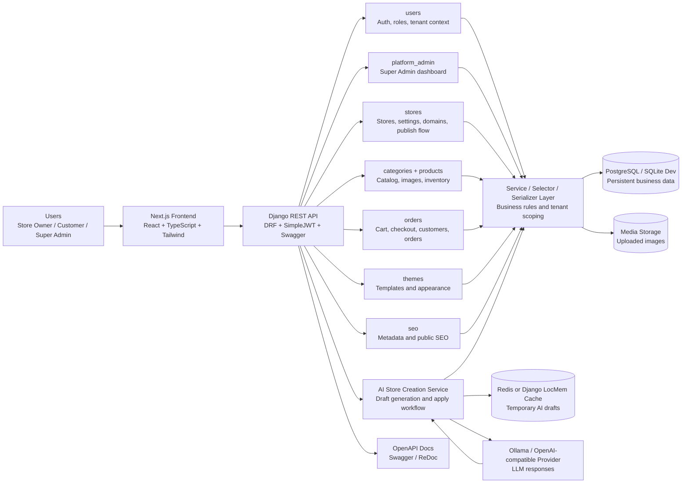
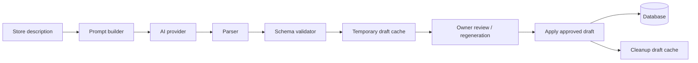

# System Architecture Diagram

Use this diagram in slides to explain the Souq Engine architecture at a high level.
The SVG version is available at `docs/system_architecture.svg`.

## AI Draft Workflow

